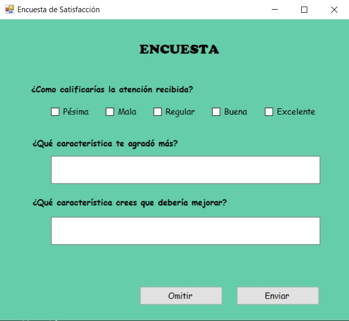
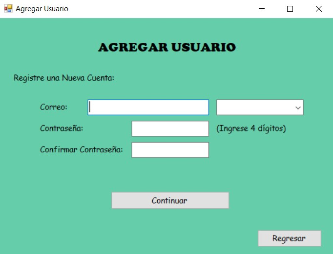
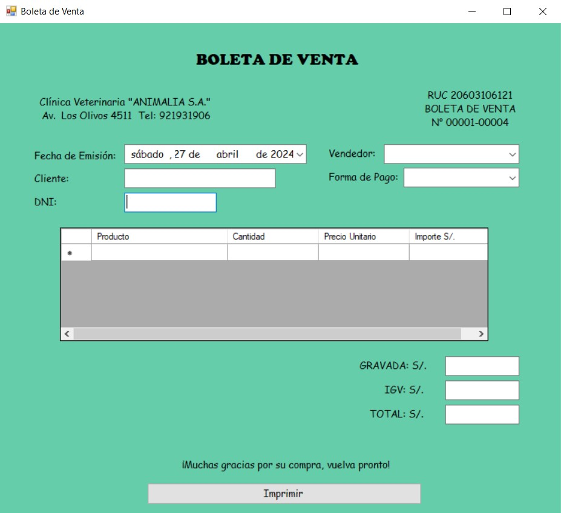
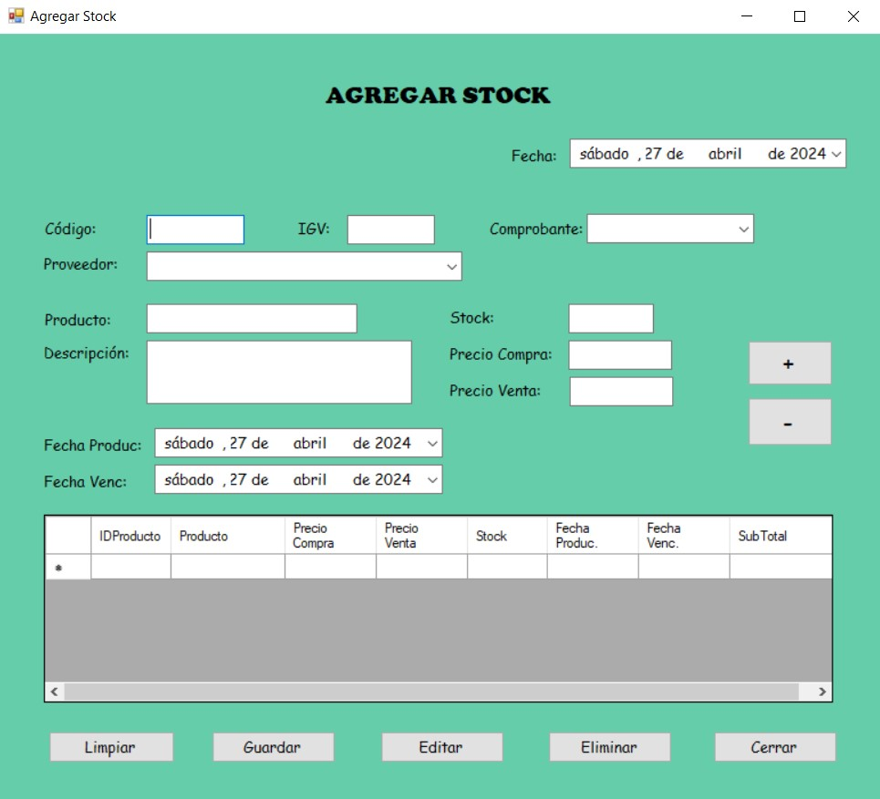
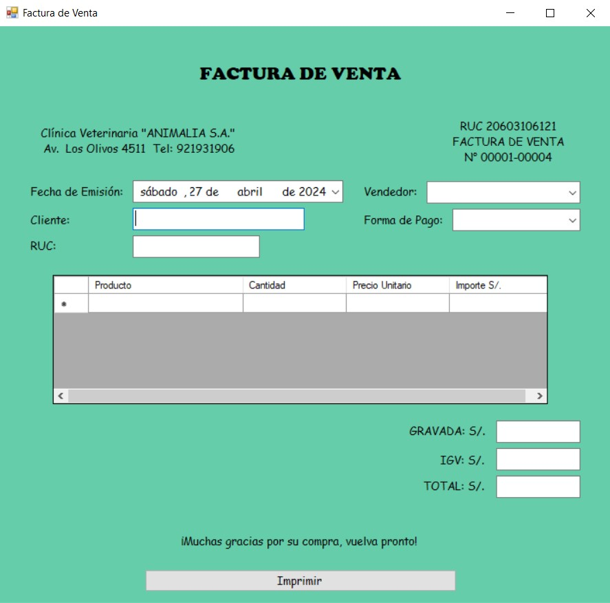
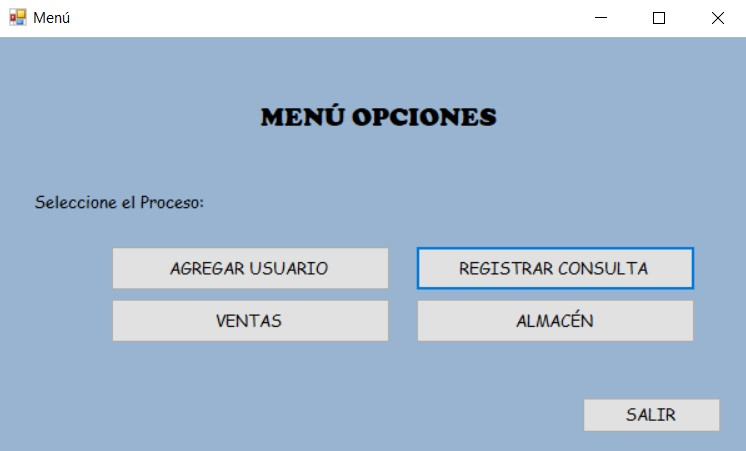
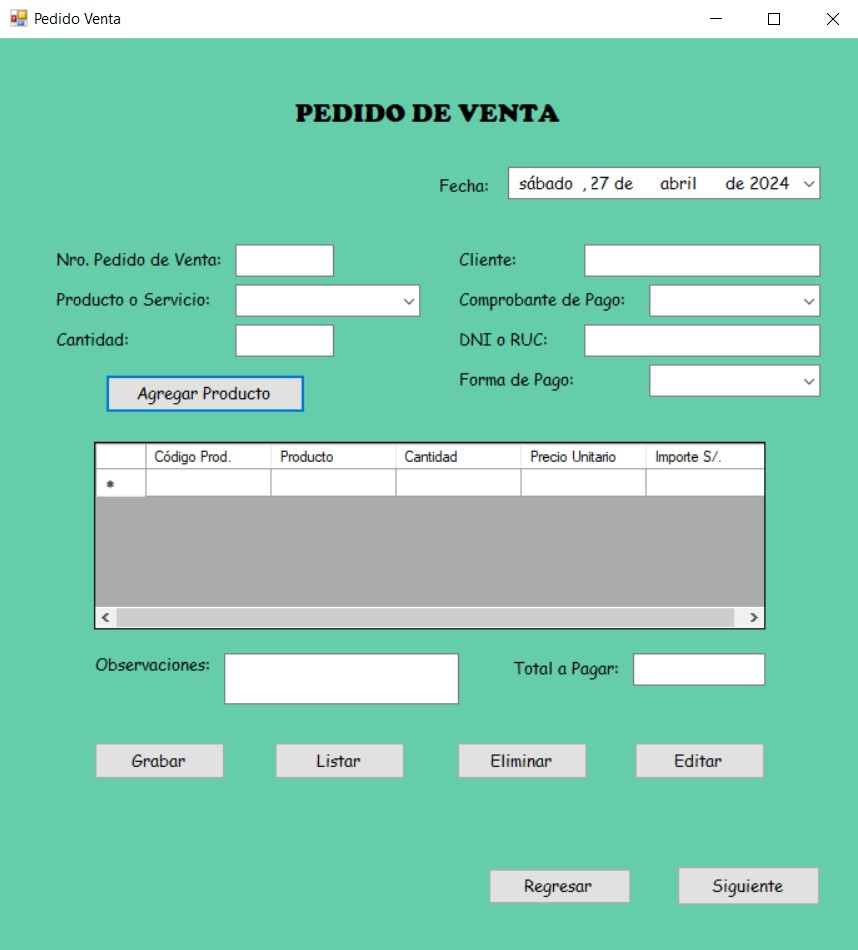
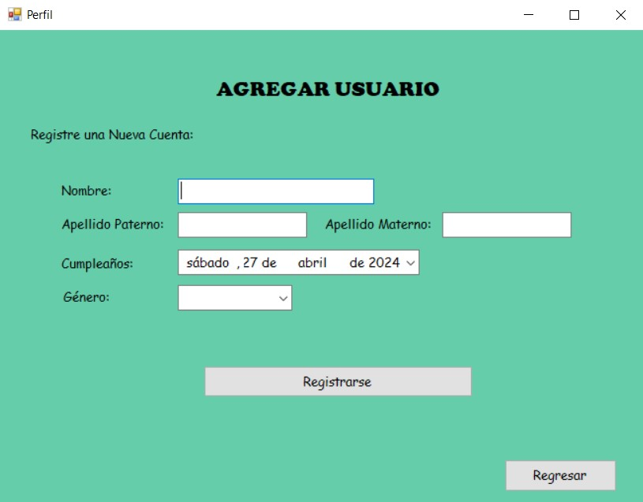
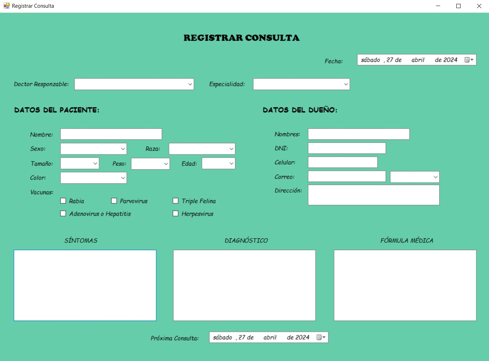

# Veterinaria Animalia S.A - Formularios
Proyecto colaborativo de formularios en C# desarrollado en el ciclo II del curso de Proyecto Certificador de Desarrollo de Software - IDAT. Contiene formularios diseñados para una empresa veterinaria, abordando aspectos como gestión de pacientes, registros médicos y citas.

 

## ❗ Detalles Importantes del Proyecto
Este proyecto fue desarrollado como parte del curso de Proyecto Certificador de Desarrollo de Software - IDAT - Ciclo II.

 

## 📷 Capturas de pantalla
<table style="width: 100%">
  <tr>
    <td style="width: 50%"></td>
    <td style="width: 50%"></td>
  </tr>
  <tr>
    <td></td>
    <td></td>
  </tr>
  <tr>
    <td></td>
    <td></td>
  </tr>
  <tr>
    <td></td>
    <td></td>
  </tr>
  <tr>
    <td colspan="2"></td>
  </tr>
</table>

